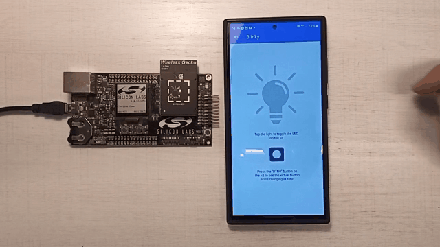

# SoC - Blinky Instructions

This demo is the "Hello World" of Bluetooth Low Energy (BLE). It allows a BLE central device to control the LED on the mainboard and receive button press notifications.

This document walks you through on how to evaluate the SoC - Blinky demo using the Simplicity Connect Mobile App.

## Getting started

After launching the app go to the demo view and select the Blinky demo. A pop-up will show all the devices around you that are running the SoC-Blinky firmware. Tap on the device to go into the demo view.

 

Tap the light on the mobile app to toggle the LED on the mainboard. When you press/release the button on the mainboard the state changes for the virtual button on the app as well.

 

The animation below showcases the demo running on an EFR32xG21 Wireless Starter Kit with the mobile app running on an Android device.

